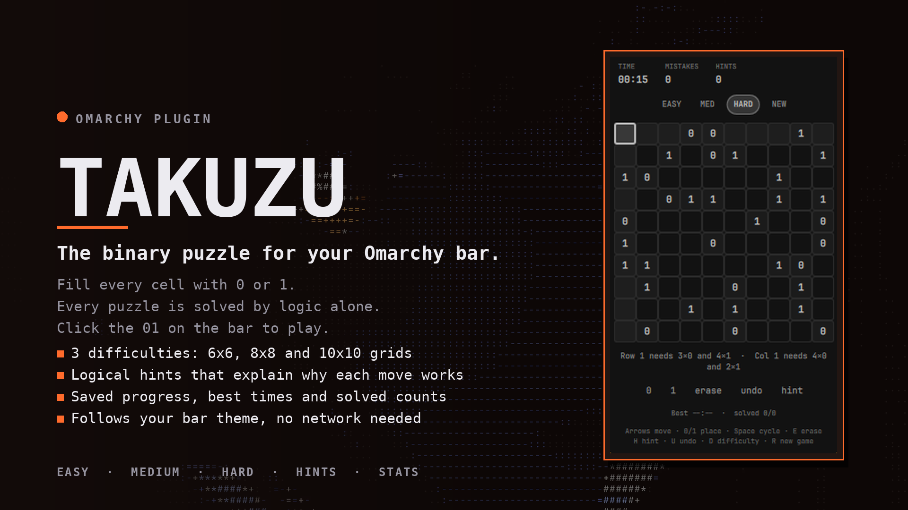

# Takuzu for Omarchy

A binary puzzle (Takuzu / Binairo) in a keyboard-driven popup on the Omarchy bar. Click the
small `01` on the bar, solve the grid, close it, and come back later: the puzzle, the timer
and your stats are saved.



## The rules

Fill every cell with `0` or `1` so that:

1. no more than two equal numbers sit next to each other, in any row or column,
2. every row and every column has the same number of `0`s and `1`s,
3. no two rows are identical, and no two columns are identical.

Every puzzle has exactly one solution and can be solved by pure logic, never by guessing.

## Features

- **3 difficulties**: Easy 6x6, Medium 8x8, Hard 10x10. Hard puzzles need the "every other way to
  finish this row would copy another row" reasoning.
- **Logical hints**: `H` fills the next cell that can be deduced and tells you *why* ("Two 0s side by
  side: a third would make three in a row"). Wrong entries are pointed out first.
- **Mistakes and timer** like a classic puzzle app, optional mistake limit, undo.
- **Row and column needs**: shows how many 0s and 1s the selected row and column still need.
- **Saved progress**: closes and reopens exactly where you were, also after a restart.
  Best time and solved count per difficulty.
- Follows the bar theme (colors, font). No network, no helper process.

## Keys

| Key | Action |
| --- | --- |
| Arrows | move |
| `0` / `1` | place |
| Space / Enter | cycle empty, 0, 1 |
| `E` / Backspace / Delete | erase |
| `H` | hint (fills one cell and explains it) |
| `U` / Ctrl+Z | undo |
| `D` | next difficulty (new puzzle) |
| `R` / `N` | new puzzle (press twice to abandon one in progress) |
| Esc | close |

With the mouse: click a cell to cycle it, right click to erase, use the buttons below the board.

## Install

```
omarchy plugin add https://github.com/qempexe/omarchy-takuzu.git --enable
```

Or from a local copy of this folder:

```
mkdir -p ~/.config/omarchy/plugins/io.github.qempexe.takuzu
cp -r ./. ~/.config/omarchy/plugins/io.github.qempexe.takuzu/
omarchy plugin validate ~/.config/omarchy/plugins/io.github.qempexe.takuzu
omarchy plugin enable io.github.qempexe.takuzu --section right
```

Open it from the shell with `omarchy-shell shell summon io.github.qempexe.takuzu '{}'`
(bind that to a key if you like). Remove: `omarchy plugin remove io.github.qempexe.takuzu`.
Saved data lives in `~/.local/state/omarchy-takuzu/state.json`.

## Settings

| Setting | Values | Default |
| --- | --- | --- |
| `showCounts` | true / false | true |
| `highlightErrors` | true / false | true |
| `mistakeLimit` | 0-9 (0 = unlimited) | 0 |
| `barTime` | true / false | true |

## Design

```
Takuzu.js     -- pure engine: generator, solver, hints, game state (seeded, deterministic)
Panel.qml     -- popup: keys, header, tabs, pad, saving; the shell's KeyboardPanel
BoardView.qml -- the grid
GameStore.qml -- state file (last level, stats, puzzle in progress)
BarWidget.qml -- the "01" button that loads the panel
```

**How puzzles are made.** A random valid grid is built by backtracking. Cells are then removed
one at a time, and a removal is kept only if the logic solver of the level still finishes the
puzzle. Logic is sound, so a logic-solvable puzzle has exactly one solution, and the tests
confirm that with an independent brute-force counter.

- Tier 1 (Easy, Medium): the "no three in a row" rule and the "half zeros, half ones" rule.
- Tier 2 (Hard): additionally looks at every way to finish a line and discards the ones that
  would copy an already finished line.

## Tests

```
node tests/test_engine.js         # generator, uniqueness, solver soundness, hints, state, save/load
python3 tests/test_manifest.py    # manifest vs QML, plain-text and structure guards
qmllint -I "$OMARCHY_PATH/shell" BarWidget.qml Panel.qml BoardView.qml GameStore.qml
```

## Status

Version 1.0.0. The engine and the static checks are covered by the tests above.

## Disclaimer

Independent project, not affiliated with or endorsed by Omarchy.

## License

MIT
